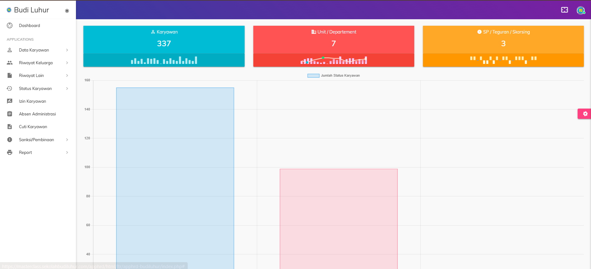

# 🏫 School HR Management System

Aplikasi administrasi sekolah berbasis web untuk membantu pengelolaan data guru, pegawai, siswa, serta kebutuhan administrasi dan pelaporan.

## 📌 Tentang Project

Project ini dibuat untuk membantu proses administrasi sekolah menjadi lebih terstruktur, cepat, dan terdigitalisasi.

## 👨‍💻 Role

Full Stack Developer

## 🛠️ Tanggung Jawab

- Analisis kebutuhan sistem
- Merancang database
- Pengembangan backend dan frontend
- Implementasi import dan export data
- Deployment dan maintenance aplikasi

## ✨ Fitur

### Master Data
- Data guru
- Data pegawai
- Data siswa
- Data kelas

### Administrasi
- Manajemen pengguna
- Hak akses pengguna
- Import data Excel
- Export data Excel
- Dashboard monitoring

### Laporan
- Laporan siswa
- Laporan guru
- Laporan pegawai
- Rekapitulasi data

## 🗄️ Database

- users
- guru
- pegawai
- siswa
- kelas
- role
- setting

## 🏗️ Tech Stack

- PHP
- CodeIgniter 4
- MySQL
- Bootstrap
- JavaScript
- jQuery
- DataTables
- PhpSpreadsheet

## 📷 Screenshot

### Dashboard

### Data Guru

### Data Pegawai

### Data Siswa

## 📚 Yang Saya Pelajari

- Enterprise Web Application
- Database Design
- Data Processing
- Excel Integration
- User Access Management
- Production Maintenance

---

⚠️ Repository ini merupakan portfolio project. Source code lengkap dan data produksi tidak dipublikasikan untuk menjaga kerahasiaan institusi.
